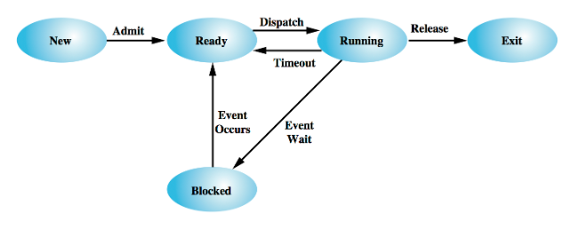

# Simulation of CPU Processes Scheduling

## Overview Of this project

The goal of this project is to implement a program, named myscheduler, to simulate the scheduling of processes on a single-CPU, multi-device system, employing a pre-emptive process scheduler.

The sysconfig file contains information about devices and the time quantum,while the command file specifies the commands or processes to be executed, along with their associated system calls.

'

## Background knowledge: Processes in Operating Systems

### Definition of a Process
The fundamental activity of an operating system is the creation, management, and termination of processes.
A process in an operating system can be naively described as:
- A program under execution.
- The "animated" existence of a program.
- An identifiable entity executed on a processor by the operating system.

### Dispatching Role of Operating Systems

The operating system serves as a dispatcher, moving processes between states. State transitions include:
- New → Ready: Resources allocated for a new process.
- Ready → Running: Process given a time quantum.
- Running → Ready: Process's time quantum expires.
- Running → Blocked: Process requests slow I/O.
- Blocked → Ready: I/O interrupt signals completion.
- Running → Exit: Normal or abnormal process termination.
- Ready/Blocked → Exit: External process termination requested.

This model helps in understanding how operating systems efficiently manage processes for optimal system performance.

'

## Project  Description

Consider an operating system's 5-State Model of Process Execution, as introduced in Lecture 7. New processes are admitted to the system and are immediately marked as Ready to run. Each process executes, in turn, until it:
completes its execution (at which time the process Exits),
executes for a finite time-quantum (after which the process is marked as Ready and is queued until it can run again),
requests to read or write from an I/O device (at which time the process is marked as Blocked and queued until its I/O request is satisfied),
sleeps for a requested time (at which time the process is marked as Blocked until the requested time elapses), or
waits for all processes that it has spawned to terminate (at which time the process is marked as Blocked until the other processes terminate).
We'll consider a simplified operating system in which only a single process occupies the single CPU at any one time. The CPU has a clock speed of 2GHz, enabling it to execute two-billion instructions per second. We do not need to consider the speed of accessing RAM.

The CPU is connected to a number of input/output (I/O) devices of differing speeds, using a single high-speed data-bus. Only a single process can use the data-bus at any one time.

Only a single process can access each I/O device (and the data-bus) at any one time. If the data-bus is in use (data is still being transferred) and a second process also needs to access the data-bus, the second process must be queued until the current transfer is complete. When a data transfer completes, all waiting (queued) processes are consider to determine which process can next acquire the data-bus. If multiple processes are waiting to acquire the data-bus, the process that has been waiting the longest for the device with the fastest read speed will next acquire the data-bus. Thus, all processes waiting on devices with high read speeds are serviced before any processes that are waiting on devices with lower read speeds.

It takes 5 microseconds to perform a context-switch - to move one process from Ready → Running.
It also takes 10 microseconds to move a process from Running → Blocked, Running → Ready, and Blocked → Ready.
All other state transitions occur instantly (unrealistic, but keeping the project simple).
It takes 20 microseconds for any process to first acquire the data-bus.

## System configuration
Consider the following sample sysconfig file which defines the characteristics of our hardware and the time-quantum for scheduling. Note that lines commencing with a '#' are comment lines, and the 'words' on each line may be separated by one-or-more space or tab characters. All speeds are in bytes-per-second (Bps), all times are in microseconds (usecs), and all I/O sizes are in bytes (B). We may assume that the format of the sysconfig file will always be correct, and its data values consistent, so we do not need to check for errors.
'
## Commands
Our simple operating system supports a small number of commands (which you can modify and extend with with your own commands). When a command is invoked, a new process is created. Multiple instances of the same command may be executing simultaneously. Each process executes a sequence of system-calls until the process exits.
Consider the following sample command file which defines the supported commands and the sequence of system-calls that they make. Each system-call made by a command is indented by a single tab, and is preceded by the elapsed execution time, in microseconds, of the process (the total time it has occupied the CPU). The times when each process's system-calls are made are guarateed to be ascending. Note that lines commencing with a '#' are comment lines, that the 'words' on each line may be separated by one-or-more space or tab characters, and that the commands do not receive or require any commnad-line arguments. We may assume that the format of the commands file will always be correct, and its data values consistent, so we do not need to check for errors.
'

## Overview of the code:

Self-defined Structures:

Device: Represents the characteristics of a device, such as its name, read speed, and write speed.
Syscall: Represents a system call with information such as runtime, type (e.g., READ, WRITE, SLEEP), target device, spawn command, I/O size, and sleep time.
Command: Represents a command or process with its name, an array of associated syscalls, current state, elapsed CPU time, executed syscalls count, and other fields for handling sleep, spawn,and wait syscalls.
Queue: Implements a basic queue structure for managing commands in various queues (e.g., ready, bus, sleep, wait).
Global Variables:

Various global variables, such as time quantum, the number of devices, an array of devices, an array of commands, and queues for managing processes.
File Reading Functions:

read_sysconfig: Reads and processes the sysconfig file, extracting information about devices and the time quantum.
read_commands: Reads and parses the command file, populating the commands array with information about commands and their associated system calls.
Queue Functions:

init_queue: Initializes a queue with a specified capacity.
init_queues: Initializes all four queues (ready, bus, sleep, wait) using init_queue.
isFull and isEmpty: Check if a queue is full or empty.
enqueue and dequeue: Enqueues and dequeues commands from a queue.
State and Queue Handling Functions:

update_state: Modifies the state of a command and updates the system run time based on state transitions.
handle_sleep_queue: Moves processes from the sleep queue to the ready queue when they wake up.
handle_wait_queue: Moves processes from the wait queue to the ready queue when all their children have exited.
handle_bus_queue: Manages access to a shared bus, determining which process has the highest priority for bus access.
Syscall Execution Functions:

execute_syscall: Executes a system call within a command, handling different types of syscalls (e.g., READ, WRITE, SLEEP, WAIT, EXIT, SPAWN).
Command Execution Function:

execute_commands: Executes the commands in a round-robin fashion, handling time quantum and syscalls. It also manages various queues and updates the total system time.
Main Function:

Reads command-line arguments, calls functions to read sysconfig and command files, initializes queues, executes commands, and prints measurements (total system time and CPU utilization).

Overall, this program simulates the execution of multiple commands with various system calls in a simple operating system environment, considering device I/O, sleeping, waiting, and spawning of processes. 
The goal is to measure the total system time and CPU utilization during the simulation.
